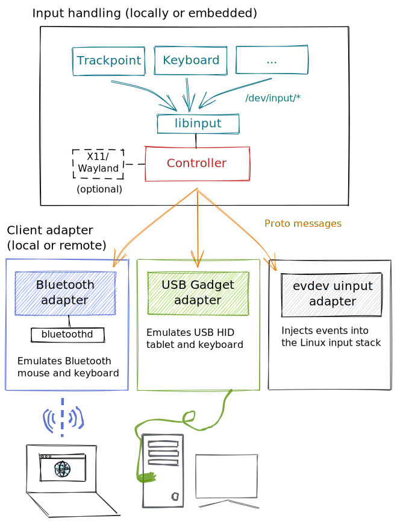

# Congruity

Congruity is a virtual, **agent-less KVM** for seamless input switching between multiple connected clients.
In contrast to [Synergy](https://github.com/symless/synergy-core), it does not require client software and instead
**emulates real USB or Bluetooth input devices**.

This closes the gap for situations where a client software-based solution like Synergy does not work:

- ChromeOS, Android or specialty operating systems as clients.
- Situations where network connectivity between hosts is a challenge.
- High-security environments that do not allow custom software or network connectivity.
- You want a plug-and-play solution without fiddly client configuration.

Data flow is unidirectional - the host sends input data to clients, there's no backchannel or clipboard syncing.

The host can either be a Wayland or Xorg Linux desktop or a headless embedded platform like a Raspberry Pi 4.

## Deployment scenarios

### Linux desktop master

### Raspberry Pi master

### Why not use Congruity?

- Congruity currently emulates **absolute input** (think "graphics tablet"). Some applications like gaming
  require relative cursor input. The fundamental reason for this is that the Congruity host needs to be the
  *authoritative source of truth* for the cursor position to know when to switch inputs - it doesn't know
  about the client's screen resolution or cursor position.

- There is **no clipboard sync** and other convenience features. This is by design - 
  there's no client-side software that could sync the clipboard. 
  
It's possible to add optional support for relative input or clipboard synchronization. 
However, this is not on our roadmap. Consider using Chrome's [shared clipboard](https://www.xda-developers.com/google-chrome-canary-adds-a-shared-clipboard-feature-for-android-and-pc/) feature.

## Bluetooth security

Using Congruity with Bluetooth carries the same risks as using regular Bluetooth peripherals
like keyboards or headphones. Which is to say - not great, not terrible.

Modern-day Bluetooth is considered reasonably secure against eavesdropping and man-in-the-middle
attacks (much more so than proprietary radio protocols used by non-BT wireless peripherals).

However, Bluetooth stacks expose attack surface at both the firmware and operating system level.
Attacks in recent years have generally targeted bugs in the stack rather than bugs in the protocol
itself. Most attack surfaces depend on knowledge of the device MAC and successful pairing:

- **Disable discoverability** on all devices.
- Avoid frequently re-pairing devices (pairing on most devices is "trust on first use").
- Unpair unused or lost devices.
- Disable Bluetooth when travelling or attending events.
- Some vendors have a bad habit 
  
Bluetooth is a low-range protocol and attacks require close physical proximity. An office
deep inside a company campus is different environment than a DEFCON hotel room.
